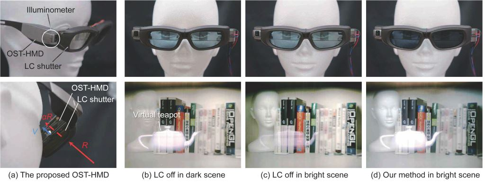

# BrightView Project

This is a project page of **BrightView**, a collaborative work of the following people.

* [Shohei Mori](https://sites.google.com/view/smori/) (Keio University)
* [Sei Ikeda](https://sites.google.com/view/ikeda-sei/home) (Ritsumeikan University)
* [Alexander Plopski](http://imd.naist.jp/people/alexanderplopski/) (Nara Institute of Science and Technology)
* [Christian Sandor](http://imd.naist.jp/people/christiansandor/) (Nara Institute of Science and Technology)

For Japanese people, we hope you to refer to [日本語](./README_JP.md).

## Abstract

Optical See-Through Head-Mounted Displays (OST-HMDs) lose the visibility of virtual contents under bright environment illumination due to their see-through nature. We demonstrate how liquid crystal (LC) filters attached to an OST-HMD work for increasing the perceived brightness of virtual contents without impacting the brightness of the real scene. In our psychophysical experiments in three scenes, participants were asked to compare the magnitude of brightness changes of both real and virtual objects, before and after dimming the LC filter. The results show that the participants felt increases in the brightness of virtual objects while they were less conscious of reductions of the real scene luminance.



**Figure** (a) Our prototype Optical See-Through Head-Mounted Display (OST-HMD) increases the \textit{perceived} brightness of virtual objects in bright conditions by dynamically adjusting liquid crystal (LC) shutters according to the measured brightness of the environment. (b) The virtual teapot appears consistent with the background in a dark environment. (c) On the other hand, it appears transparent and dim in a bright environment. (d) By gradually adjusting the transparency of the LC shutters, the teapot is perceived as  brighter, while the background is perceived as unchanged. Images (b), (c), and (d) were captured directly through our prototype with a PointGrey Flea3 camera with automatic shutter speed. We present psychophysics experiments validating that users indeed perceive an improvement akin to the difference between (c) and (d).

## Publications
### IEEE VR 2018

Shohei Mori, Sei Ikeda, Alex Plopski, and Christian Sandor: BrightView: Increasing Perceived  Brightness of Optical See-Through Head-Mounted Displays Through Unnoticeable Incident Light Reduction, Proc. IEEE Virtual Reality (2018.3) **to appear**

* Paper: [IEEE Xplore (NA)](./), [Author PDF](./papers/vr2018/brightview-vr2018.pdf)
* Slides: [PowerPoint (NA)](./), [SlideShare (NA)](./) [PDF (NA)](./)
* BibTex
```tex
@proceedings{BrightViewIEEEVR2018,
	author = {Shohei Mori and Sei Ikeda and Alexander Plopski and Christian Sandor},
	title = {BrightView: Increasing Perceived Brightness of Optical See-Through Head-Mounted Displays Through Unnoticeable Incident Light Reduction},
	booktitle = {IEEE Virtual Reality},
	year = {2018},
	pages = {},
	url = {}
}
```

### IEEE ISMAR 2017

Shohei Mori, Sei Ikeda, Christian Sandor, and Alexander Plopski: BrightView: Increasing Perceived Brightness in Optical See-through Head-mounted Displays, Proc. ISMAR-adjunct, pp. 202 - 203 (2017.10)

* Poster paper: [IEEE Xplore](http://ieeexplore.ieee.org/document/8088483/)
* Poster: [PDF](./papers/ismar2017/poster_ismar2017.pdf)
* BibTex
```tex
@proceedings{BrightViewISMAR2017,
	author = {Shohei Mori and Sei Ikeda and Christian Sandor and Alexander Plopski},
	title = {BrightView: Increasing Perceived Brightness in Optical See-through Head-mounted Displays},
	booktitle = {IEEE Int. Symp. on Mixed and Augmented Reality (ISMAR)-Adjunct},
	year = {2017},
	pages = {202--203},
	url = {http://ieeexplore.ieee.org/document/8088483/}
}
```

## Fund

* JSPS KAKENHI, Grant-in-Aid for Young Scientists (B), Grand Number 17K12729: [https://kaken.nii.ac.jp/en/grant/KAKENHI-PROJECT-17K12729/](https://kaken.nii.ac.jp/en/grant/KAKENHI-PROJECT-17K12729/)